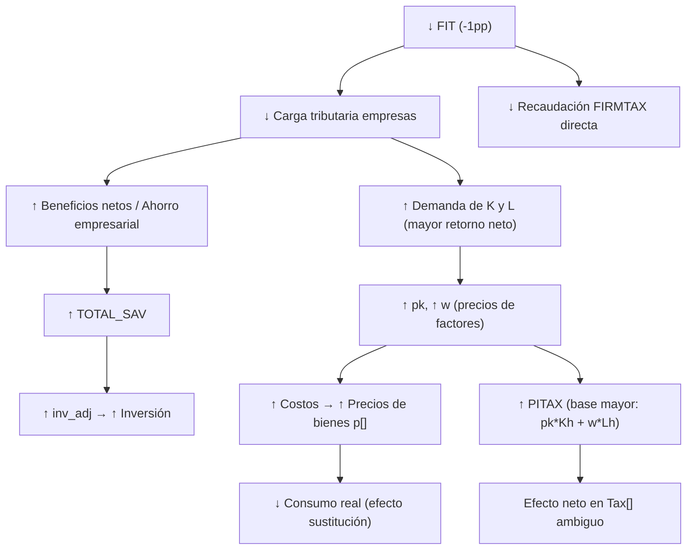
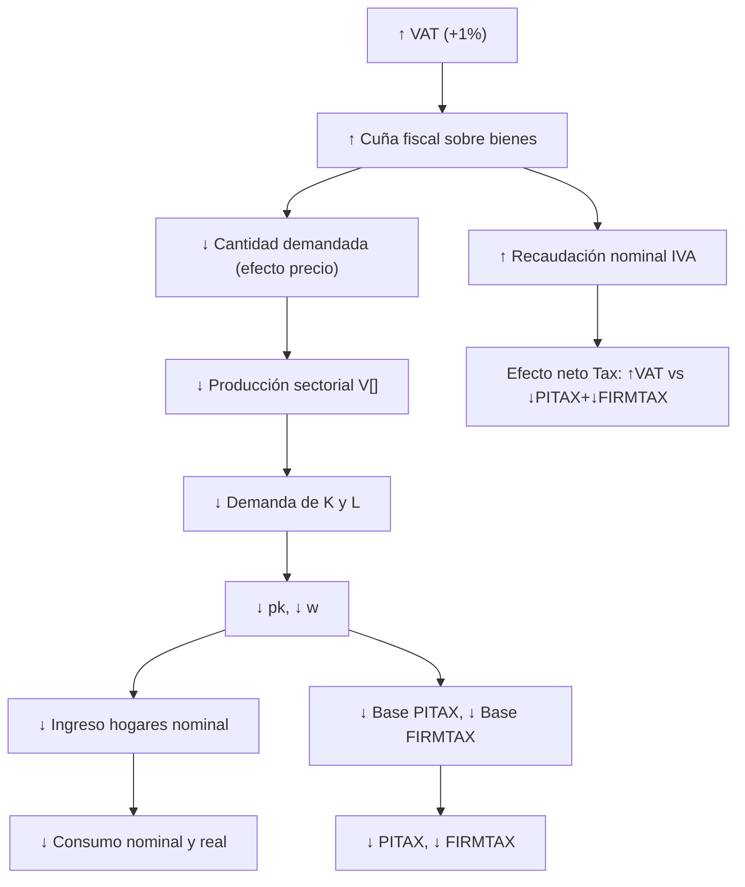

# Análisis Crítico del Modelo CGE de 6 Sectores — Shocks Tributarios

## 1. Resumen del Modelo

El modelo es un CGE estático de 6 sectores calibrado con una SAM de Chile 2022, implementado en gEcon. Incluye:

| Bloque | Descripción |
|--------|-------------|
| **CONSUMER** | Hogar representativo con utilidad CES (ω=0.5) sobre 4 bienes de consumo |
| **SECTORS_A/B/C** | 6 actividades productivas con tecnología Cobb-Douglas (K, L, insumos intermedios) |
| **PRODUCTS** | Vaciado de mercado (6 mercados de bienes), recaudación de IVA y aranceles |
| **FIRM** | Empresa representativa (ahorro, impuesto a utilidades, transferencias) |
| **GOB** | Gobierno (recaudación tributaria, transferencias, ahorro fiscal) |
| **EQUILIBRIUM** | Cierre: mercado laboral, capital fijo, tipo de cambio fijo (numerario) |
| **INVESTMENT** | Ahorro-inversión con ajuste endógeno (`inv_adj`) |

---

## 2. Shocks Simulados

| Shock | Descripción | Implementación |
|-------|-------------|----------------|
| **FIT** | Disminución de 1 pp en impuesto a empresas | `fit_base + (-0.010)` |
| **VAT** | Aumento de 1% en IVA (todas las tasas) | `vat_base * 1.010` |

---

## 3. Análisis del Cierre Macroeconómico (Closure Rules)

### 3.1 Variables Fijas (Exógenas en Shocks)

```
exr[] = 1.0          → Tipo de cambio fijo (numerario)
Kh[], Lh[], Kf[], Kg[] → Capital/trabajo institucional: proporciones fijas del total
K_total_data          → Oferta total de capital fija
edp, mdp              → Exportaciones e importaciones: CANTIDADES FIJAS (parámetros)
gg_market_data_p      → Gasto de gobierno por producto: CANTIDADES FIJAS
```

### 3.2 Variables Endógenas Clave

```
p[]     → Precios de bienes (6 precios)
pk[]    → Retorno al capital (endógeno)
w[]     → Salario (endógeno — despejado por vaciado del mercado laboral)
V[]     → Volumen de producción sectorial
K[], L[] → Asignación sectorial de factores
D[]     → Consumo de hogares
inv_adj  → Ajuste de inversión (savings-driven)
```

> [!IMPORTANT]
> **Crítica principal del cierre**: El tipo de cambio real está fijado en 1.0 y las cantidades de exportaciones e importaciones son **parámetros fijos**. Esto significa que el sector externo **no ajusta** ante shocks tributarios domésticos. Todo el ajuste recae sobre precios internos (pk, w, p) y cantidades domésticas (V, K, L, D).

---

## 4. Evaluación de Respuestas Esperadas vs. Modelo

### 4.1 Shock FIT: Disminución de 1 pp en Impuesto a Empresas

#### Transmisión Teórica Esperada



#### ¿Qué debería ocurrir en el modelo?

| Variable | Dirección Esperada | Razón |
|----------|-------------------|-------|
| `FIRMTAX` | ↓ | Tasa menor * base similar ≈ recaudación menor |
| `pk` | ↑ (levemente) | Mayor demanda de capital sin cambio en oferta total |
| `w` | ↑ (levemente) | Oferta laboral fija, mayor producción |
| `SAVf` | ↑ | Menor carga tributaria → mayor ahorro empresarial |
| `inv_adj` | ↑ | Mayor ahorro total impulsa inversión |
| `PIB real` | ↑ (muy leve) | Más inversión, producción ligeramente mayor |
| `PITAX` | ↑ (leve) | Bases nominales mayores por ↑pk, ↑w |
| `Tax` (total) | Ambiguo | Depende de magnitud relativa ↓FIT vs ↑PITAX+↑VAT |
| `Consumo real` | Ambiguo | ↑w mejora ingreso, pero ↑p reduce poder adquisitivo |

> [!WARNING]
> **Problema potencial**: El modelo define `FIRMTAX[] = fit * (Kf[] * pk[])`. El capital de la firma `Kf[]` es **fijo** (proporción fija del capital total). Por lo tanto, si `pk` sube por el efecto de equilibrio general, la recaudación `FIRMTAX` podría **no caer** o incluso **subir** a pesar de la reducción en la tasa `fit`. Esto es un comportamiento contra-intuitivo pero **internamente consistente** dado el cierre del modelo.

---

### 4.2 Shock VAT: Aumento de 1% en IVA

#### Transmisión Teórica Esperada



#### ¿Qué debería ocurrir en el modelo?

| Variable | Dirección Esperada | Razón |
|----------|-------------------|-------|
| `VAT` | ↑ | Tasa mayor × base × precio (dominado por tasa) |
| `pk` | ↓ | Menor actividad → menor demanda de capital |
| `w` | ↓ | Menor producción → menor demanda laboral |
| `PITAX` | ↓ | Base (pk*Kh + w*Lh + ...) se contrae |
| `FIRMTAX` | ↓ | Base (Kf*pk) se contrae por ↓pk |
| `D[]` (consumo) | ↓ | Mayor carga fiscal reduce consumo |
| `PIB real` | ↓ | Menor consumo e inversión |
| `Tax` (total) | Ambiguo | Depende de elasticidades |
| `inv_adj` | ↓ | Menor ahorro total |

---

## 5. Problemas Estructurales Identificados

### 5.1 ⚠️ Comercio Exterior Completamente Rígido

```
edp, mdp = parámetros fijos (cantidades de X y M)
exr[] = 1.0 (tipo de cambio fijo)
```

**Impacto**: Ante un aumento de IVA, la economía no puede sustituir demanda doméstica por exportaciones ni ajustar importaciones. Todo el ajuste se concentra en precios de factores y cantidades domésticas. Esto **amplifica** el impacto en `pk` y `w` y **subestima** el ajuste por la vía del sector externo.

**Consecuencia económica**: En una economía abierta como Chile, el efecto sobre el PIB real debería atenuarse parcialmente por sustitución de demanda doméstica por exportaciones. El modelo no captura esto.

### 5.2 ⚠️ Gasto de Gobierno en Cantidades Fijas

```
gg_market_data_p = parámetro fijo (cantidades)
```

El gasto de gobierno no reacciona al mayor ingreso fiscal. Si sube la recaudación por VAT, el gobierno simplemente acumula más ahorro (`SAVg`), no aumenta gasto. Esto es una elección de cierre válida ("ahorro del gobierno endógeno"), pero implica que **no hay efecto multiplicador fiscal**.

### 5.3 ⚠️ Elasticidad de Sustitución del Consumo Muy Baja

```
omega_val = 0.5  →  σ = 0.5 (complementos brutos)
```

Con ω = 0.5, los bienes son **complementarios** y el consumidor ajusta poco su composición de consumo ante cambios de precios relativos. Esto implica:
- El efecto del IVA sobre la composición de consumo será **atenuado**
- El ajuste recaerá más sobre el **nivel total de consumo** que sobre la reasignación entre bienes
- En la práctica, la capacidad de sustitución de los hogares chilenos es probablemente mayor (estudios empíricos sugieren σ ≈ 1-2 para bienes de consumo agregados)

### 5.4 ⚠️ Vaciado de Mercado con Impuestos en Unidades Físicas

En el bloque PRODUCTS, el vaciado de mercado es:

```
Oferta_fisica + mdp + (VAT_p / p) + (Arancel_p / p) + (imptos_espec_p / p) = TD
```

Aquí `VAT_p / p` convierte la recaudación nominal en unidades "físicas" para igualar oferta y demanda. Esto es una convención contable, pero genera un **efecto peculiar**: cuando sube VAT, sube `VAT_p`, y `VAT_p/p` actúa como si los impuestos fueran un "bien adicional" que entra en el mercado. Esto puede generar:

> [!CAUTION]
> **Los impuestos como "oferta fantasma"**: Al dividir la recaudación por el precio, se crea un término que actúa como oferta adicional ficticia en el mercado. Si bien numéricamente permite cuadrar el sistema, la interpretación económica es que el gobierno "devuelve" al mercado bienes equivalentes al IVA — lo cual no es lo que ocurre. Podría distorsionar la señal de precios si el IVA es una fracción significativa de la demanda doméstica.

### 5.5 ⚠️ Definición del FIRMTAX

```
FIRMTAX[] = fit * (Kf[] * pk[])
```

El impuesto a empresas se cobra sobre el **ingreso del capital de las empresas** (`Kf * pk`), no sobre las utilidades netas. Esto es una simplificación que funciona como un impuesto al capital. En la práctica:
- Si `pk` ↑ (por shock FIT-), FIRMTAX podría ↑ a pesar de ↓fit
- La base tributaria no incluye costos, por lo que es más bien un impuesto bruto al capital

### 5.6 ⚠️ PITAX Sobre Ingreso Bruto Antes de Ahorro

```
PITAX[] = pit * (pk[] * Kh[] + w[] * Lh[] + TRGOV[] + TREMP[] + PSh[] + fact_row_in_k + fact_row_in_l)
```

La base de PITAX incluye **transferencias del gobierno y empresas** (TRGOV, TREMP, PSh), lo cual es correcto, pero también incluye `fact_row_in_k_data` y `fact_row_in_l_data` que están **fijados en cero**. Esto significa que el ingreso de factores del resto del mundo no tributa, lo cual puede ser intencional.

---

## 6. Tabla Resumen: Predicciones Esperadas y Validez

### Shock FIT (↓1pp)

| Variable | Dirección Esperada | ¿Modelo debería replicar? | Notas |
|----------|-------------------|--------------------------|-------|
| `fit` | ↓ | ✅ Exógeno | Por construcción |
| `FIRMTAX` | ↓ o ambiguo | ⚠️ Posiblemente ↑ | Depende de ↑pk. Base = Kf(fijo)*pk |
| `pk` | ↑ leve | ✅ Probable | Menor carga → mayor retorno neto → ↑demanda K |
| `w` | ↑ leve | ✅ Probable | Mayor producción → ↑demanda L contra oferta fija |
| `PITAX` | ↑ leve | ✅ Probable | Base nominal sube con pk y w |
| `VAT` | ↑ leve | ✅ Probable | Base × precios sube |
| `Tax` | Ambiguo | ⚠️ | ↓FIRMTAX vs ↑{VAT, PITAX, TPROD} |
| `PIB real` | ↑ leve | ✅ | Más inversión (↑SAVf → ↑inv_adj) |
| `Consumo real` | Ambiguo | ⚠️ | ↑ingreso pero ↑precios |
| `Inversión real` | ↑ | ✅ | ↑ahorro empresarial |

### Shock VAT (↑1%)

| Variable | Dirección Esperada | ¿Modelo debería replicar? | Notas |
|----------|-------------------|--------------------------|-------|
| `vat` | ↑ | ✅ Exógeno | Por construcción |
| `VAT` | ↑ | ✅ Probable | Tasa mayor domina sobre base menor |
| `pk` | ↓ leve | ✅ Probable | Menor actividad → menor demanda K |
| `w` | ↓ leve | ✅ Probable | Menor producción → menor demanda L |
| `PITAX` | ↓ leve | ✅ Probable | Base se contrae con pk y w |
| `FIRMTAX` | ↓ leve | ✅ Probable | Base = Kf*pk, pk cae |
| `Tax` | ↑ o ambiguo | ⚠️ | ↑VAT vs ↓{PITAX, FIRMTAX, TPROD} |
| `PIB real` | ↓ leve | ✅ | Menor consumo, menor inversión |
| `Consumo real` | ↓ | ✅ | Menor ingreso real hogares |
| `Inversión real` | ↓ | ✅ | Menor ahorro total |
| `Exportaciones` | Sin cambio | ⚠️ Fijadas | No puede ajustar |
| `Importaciones` | Sin cambio | ⚠️ Fijadas | No puede ajustar |

---

## 7. Problemas en el Script de Evaluación (`eval_shocks.Rmd`)

### 7.1 Deflactor Inadecuado para Comparación Real

```r
deflator <- pib_shock_list$PIB / pib_shock_list$PIB_real
comp$Shock_Real <- comp$Shock / deflator
```

El deflactor calculado como PIB_nominal/PIB_real es un **deflactor del PIB agregado**. Usar este deflactor para deflactar variables como `Tax`, `FIRMTAX`, `VAT`, `w`, `pk` es **conceptualmente incorrecto**:

- `w` es un precio, no corresponde deflactarlo con el deflactor del PIB
- `pk` es un retorno al capital, tampoco corresponde deflactarlo así
- Los impuestos deberían compararse como proporción del PIB o en unidades de numerario

> [!TIP]
> **Recomendación**: Dado que `exr=1` es el numerario, todos los precios y variables nominales ya están expresados en unidades del numerario. Comparar directamente `Shock/Base - 1` es válido en un modelo con numerario fijo. El deflactor solo tiene sentido para calcular **cantidades reales implícitas**, no para deflactar precios.

### 7.2 El PIB Real (Laspeyres) es Parcial

```r
# En calc_pib: G_real y X_real usan parámetros fijos × p_base=1
G_real <- sum(par_vals[...] * p_base)  # = sum(gg_market_data_p) = constante
X_real <- sum(par_vals[...] * p_base)  # = sum(edp) = constante
M_real <- sum(par_vals[...] * p_base)  # = sum(mdp) = constante
```

Los componentes G_real, X_real y M_real **nunca cambian** entre base y shock porque son parámetros fijos multiplicados por p_base=1. Por lo tanto, el PIB real solo varía por:
- `C_real` (consumo en cantidades)
- `I_real` (inversión: I_data fijo × inv_adj endógeno)
- `V_real` (variación de existencias fija)

Esto significa que **el PIB real del modelo solo capta ajustes en consumo e inversión**, lo cual es correcto dado la estructura del modelo, pero limita la interpretación.

### 7.3 Shock FIT: Dirección del Shock

```r
fit_shock <- as.numeric(fit_base) + (-0.010)  # Disminución
```

El título dice "Disminución FIT" pero se evalúa como shock expansivo (menos impuestos → más actividad). Si el objetivo es evaluar **incrementos de impuestos**, debería ser `+ 0.010`:

```r
fit_shock <- as.numeric(fit_base) + 0.010  # Incremento
```

> [!WARNING]
> El shock FIT en `eval_shocks.Rmd` es una **disminución** de impuesto (expansivo), no un incremento. La solicitud pide evaluar "incremento de impuesto". El shock de VAT sí es un incremento.

---

## 8. Evaluación de Consistencia Interna: Ley de Walras

En un modelo CGE correctamente especificado, la Ley de Walras debe cumplirse: si N-1 mercados están en equilibrio, el N-ésimo también lo está. El modelo tiene:

- 6 mercados de bienes (vaciados explícitamente en PRODUCTS)
- 1 mercado laboral (vaciado en EQUILIBRIUM)
- 1 mercado de capital (vaciado en EQUILIBRIUM)
- 1 identidad ahorro-inversión (bloque INVESTMENT)

Con `exr=1` como numerario, hay 8 precios relativos (`p[1..6]`, `pk`, `w`) y 8 ecuaciones de equilibrio. La Ley de Walras asegura que si 7 se cumplen, la 8ª se cumple automáticamente. Dado que gEcon resuelve todas simultáneamente, la consistencia se valida por el **vector de residuos** post-solución.

> [!NOTE]
> Si `pracma::Norm(model@residual_vector)` < 1e-5 para ambos shocks, el modelo es internamente consistente. Los problemas no son de consistencia numérica sino de **interpretación económica** de las respuestas.

---

## 9. Recomendaciones de Mejora

### Prioridad Alta

1. **Endogenizar exportaciones e importaciones con funciones de Armington/CET**
   - Sustituir `edp` y `mdp` fijos por funciones de transformación (CET para exportaciones) y Armington (CES para import-doméstico)
   - Esto permite que la economía ajuste su balanza comercial ante shocks tributarios

2. **Corregir la dirección del shock FIT** si el objetivo es evaluar incrementos:
   ```r
   fit_shock <- as.numeric(fit_base) + 0.010  # Incremento
   ```

3. **Eliminar el deflactor incorrecto** en `calc_tax_impact`:
   - Comparar variables directamente en unidades del numerario
   - O usar un índice de precios apropiado (IPC ponderado por consumo) para deflactar

### Prioridad Media

4. **Endogenizar el gasto de gobierno** al menos parcialmente (e.g., gobierno mantiene gasto real constante o lo ajusta proporcionalmente a recaudación)

5. **Revisar ω (elasticidad de sustitución del consumo)**: ω=0.5 puede ser demasiado restrictivo. Considerar ω=1 (Cobb-Douglas) o valores empíricos para Chile

6. **Separar la base de FIRMTAX**: Idealmente debería ser sobre utilidades netas, no sobre ingreso bruto del capital

### Prioridad Baja

7. **Agregar elasticidad de oferta laboral** o migración para capturar ajustes en el mercado del trabajo

8. **Hacer endógenas las decisiones de inversión** (en lugar del cierre savings-driven con `inv_adj`)

---

## 10. Conclusión

El modelo es **internamente consistente** si converge con residuos pequeños, pero tiene **limitaciones importantes** en la interpretación económica de los resultados:

| Aspecto | Evaluación |
|---------|-----------|
| Consistencia numérica | ✅ Si residuos < tol |
| Dirección cualitativa de precios (pk, w) | ✅ Correcta |
| Dirección de recaudación VAT | ✅ Correcta (sube) |
| Dirección de recaudación FIRMTAX | ⚠️ Puede ser contraintuitiva |
| Magnitud de efectos en PIB real | ⚠️ Solo capta C e I |
| Ajuste sector externo | ❌ No existe (X, M fijos) |
| Respuesta fiscal del gobierno | ❌ No existe (G fijo) |
| Deflactor usado en evaluación | ❌ Conceptualmente incorrecto |
| Shock FIT como "incremento" | ❌ Es una disminución en el código |

El modelo **captura correctamente los mecanismos de transmisión de primer orden** (precios de factores, sustitución del consumo), pero **omite canales de segundo orden importantes** (ajuste comercial, respuesta fiscal, inversión endógena por rentabilidad). Para un análisis de política tributaria robusto, se recomienda especialmente endogenizar el sector externo con funciones Armington/CET.
