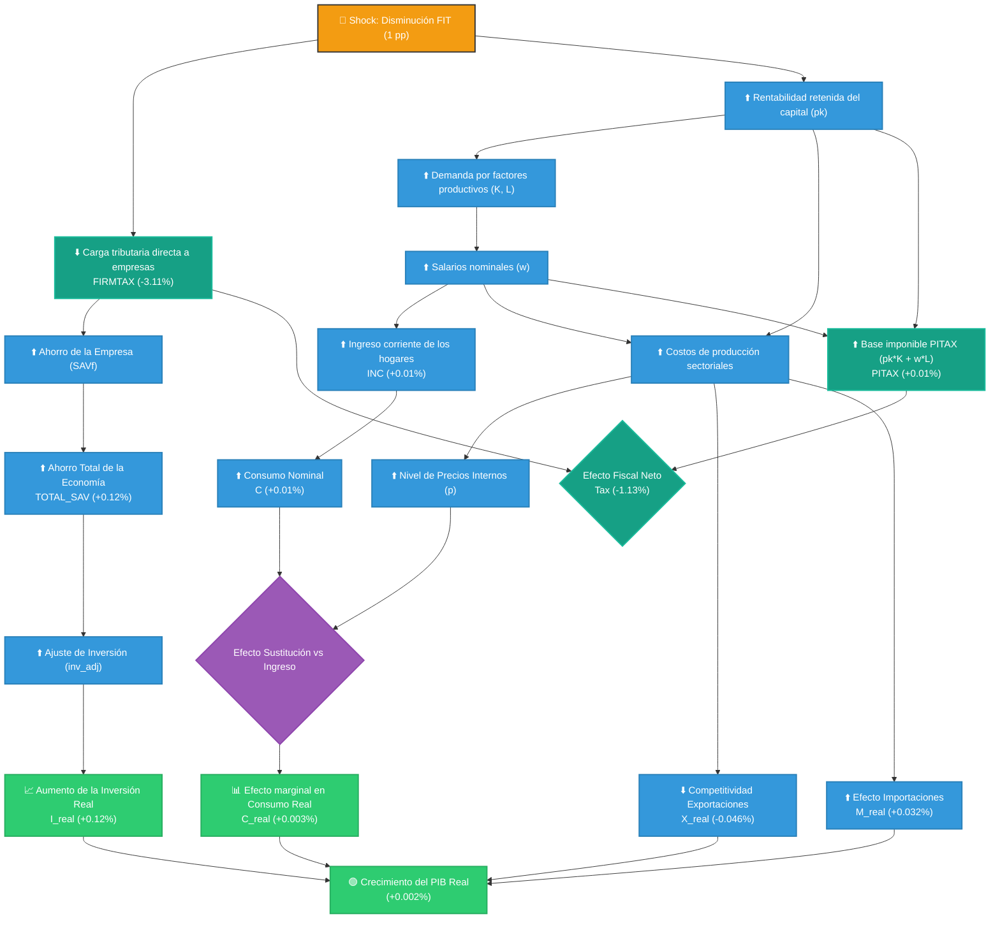
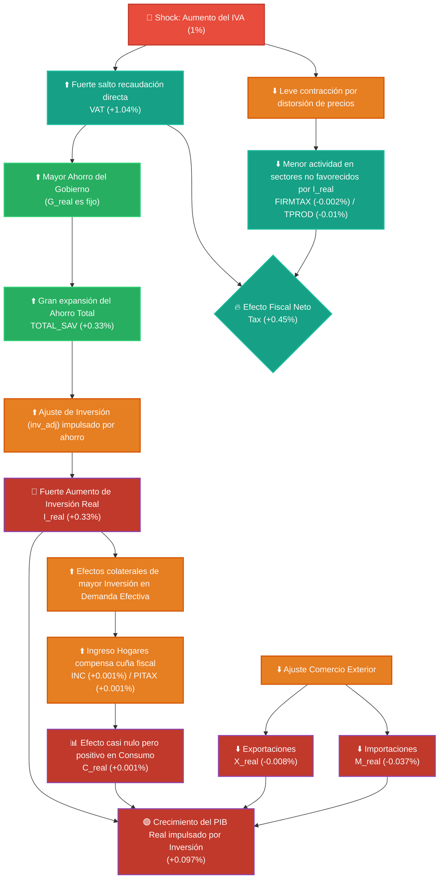

# Diagramas de Impacto Macroeconómico

A continuación presento los diagramas conceptuales de transmisión (flujogramas) solicitados usando Mermaid, los cuales ilustran cómo las políticas tributarias simuladas afectan a los distintos componentes de la economía dentro de tu modelo CGE de 6 sectores.

## 1. Escenario 1: Disminución del 1% en la Tasa de Diferimiento de Utilidades (FIT)

Este diagrama traza la ruta desde la rebaja del impuesto a las empresas hasta el impacto final en el PIB real. Al bajar el impuesto corporativo, el efecto principal se canaliza vía mayor ahorro e inversión, y secundariamente por mejores retornos a los factores (capital y trabajo).

---

## 2. Escenario 2: Aumento del 1% en el Impuesto al Valor Agregado (IVA)

Este diagrama detalla cómo un alza en las tasas del IVA introduce una cuña entre los precios al productor y al consumidor, contrayendo la demanda interna de forma generalizada y afectando los retornos de los factores.

