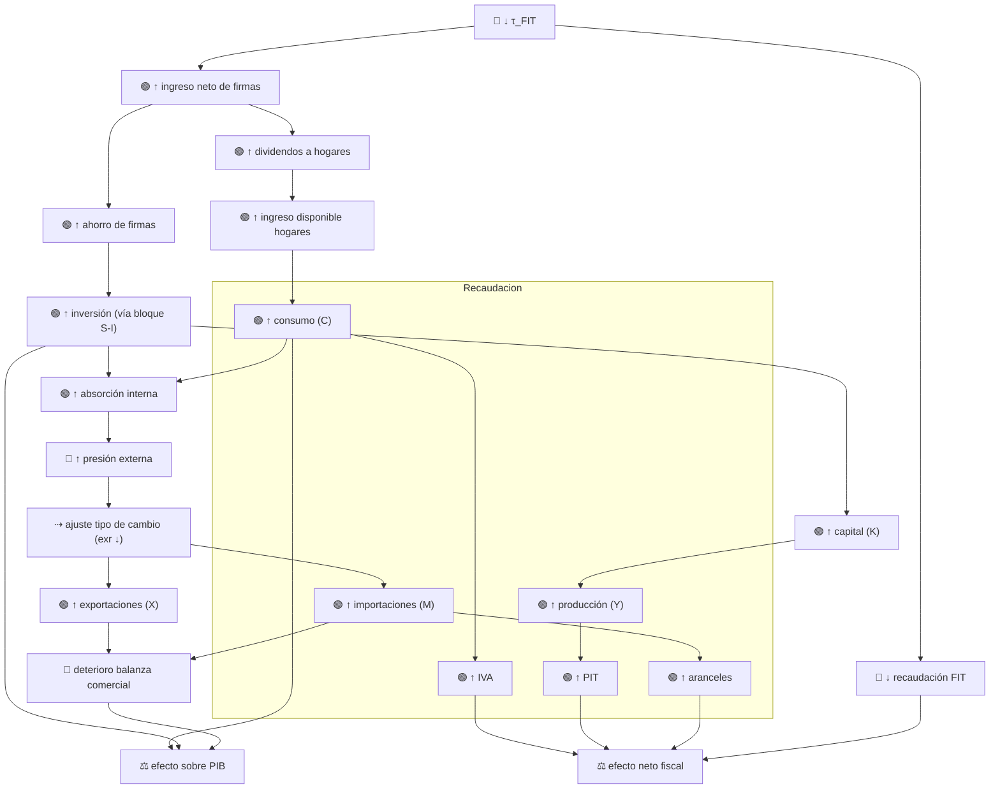
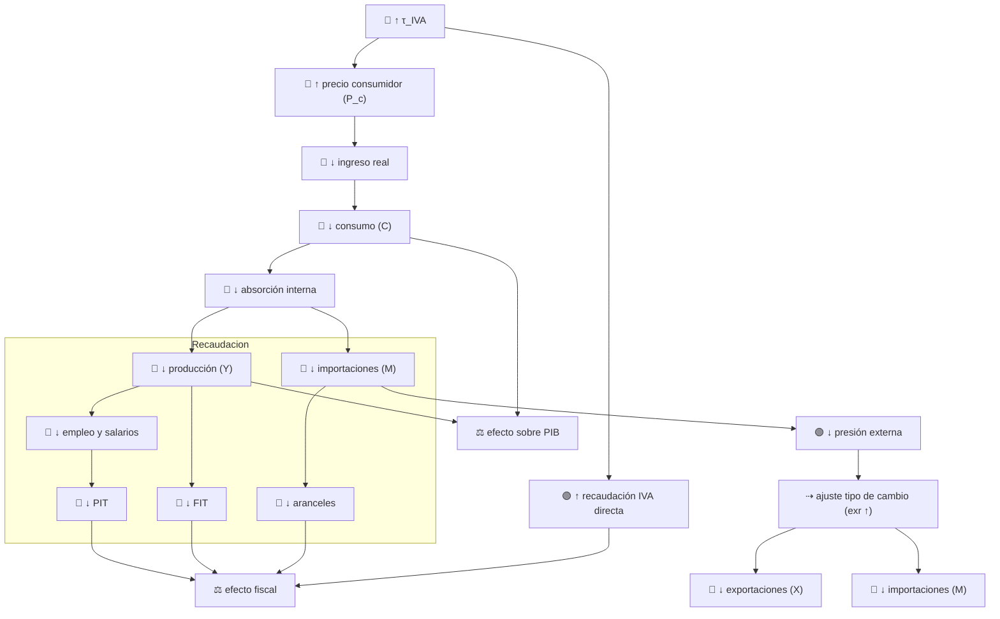
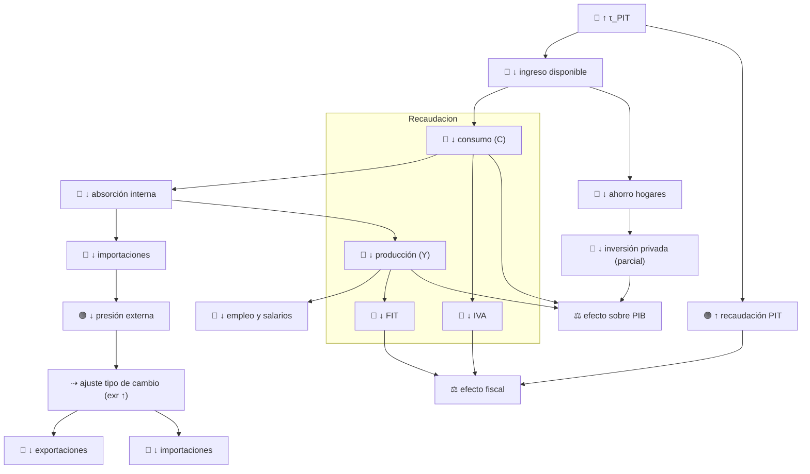

1. Disminución del Impuesto a las Empresas (FIT)

Shock: ↓ τ_FIT

Esquema de Transmisión

2. Aumento del IVA

Shock: ↑ τ_IVA

Esquema de Transmisión

3. Aumento del PIT

Shock: ↑ τ_PIT

Esquema de Transmisión
