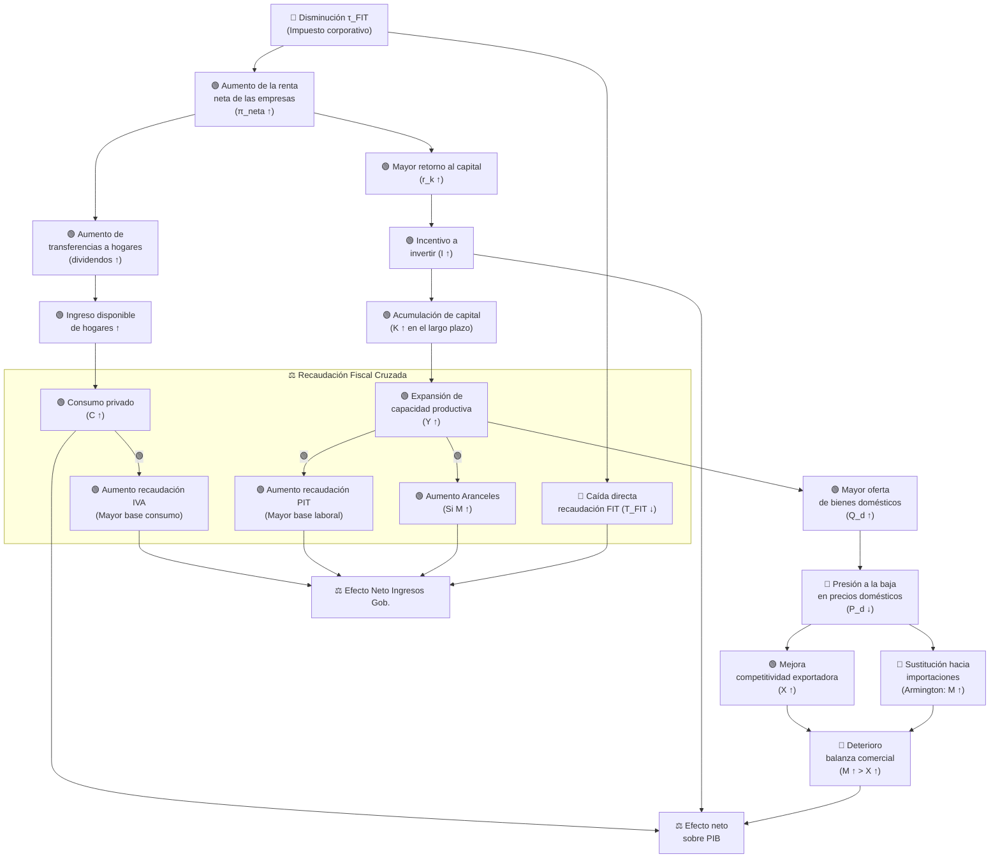
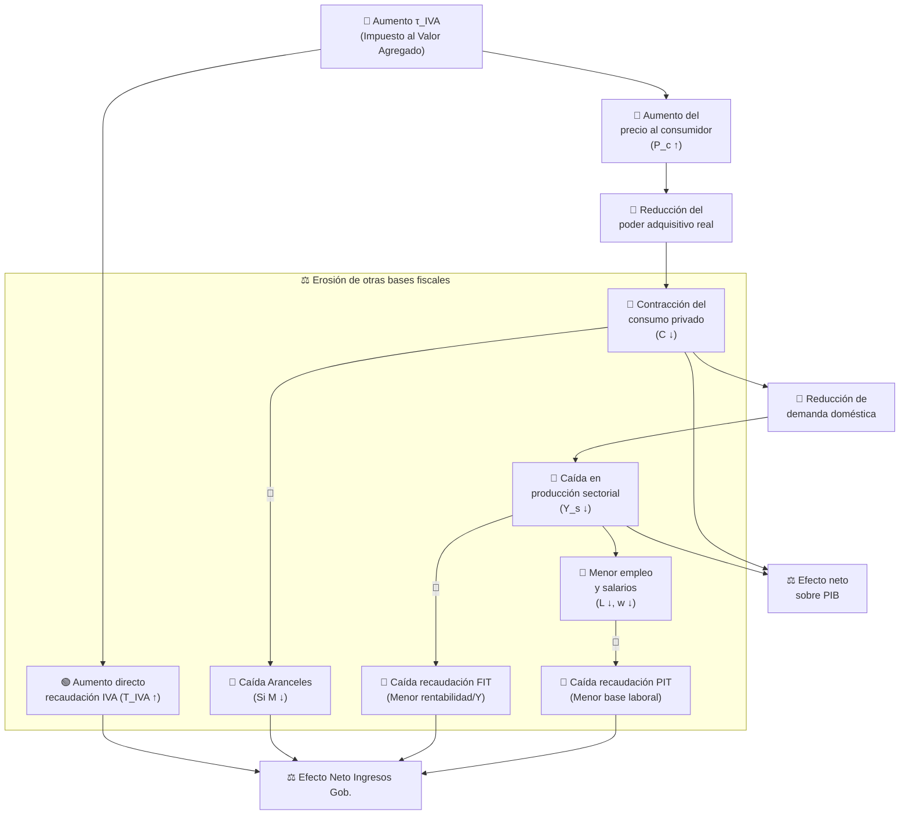
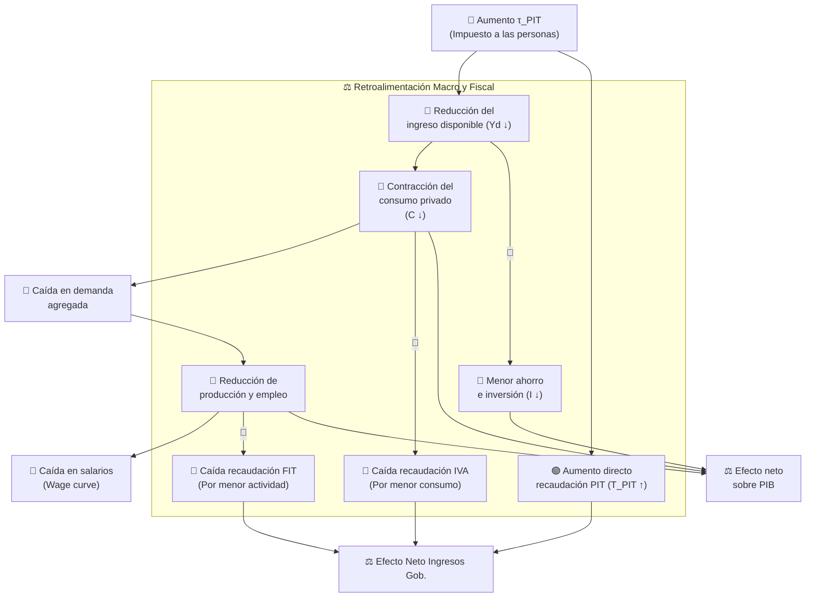

# Esquemas de Transmisión de Efectos — Políticas Fiscales Simuladas
### Modelo de Equilibrio General Computable — Chile (6 Sectores)

---

> **Convenciones:**
> - 🔴 Efecto negativo / reducción
> - 🟢 Efecto positivo / expansión
> - ⚖️ Efecto ambiguo / depende de parámetros
> - Las flechas sólidas (→) indican el canal de transmisión principal.
> - Las flechas punteadas (⇢) indican efectos secundarios o de equilibrio general.
> - **[EFECTO CRUZADO]**: Destaca el impacto de un cambio tributario sobre la base de otros impuestos.

---

## 1. Disminución del Impuesto a las Empresas (FIT — *Firm Income Tax*)

**Shock:** Reducción de la tasa del impuesto corporativo $\tau^{FIT}$

### Esquema de Transmisión

### Resumen de Canales e Impacto Fiscal Cruzado

| Canal | Mecanismo | Signo |
|---|---|---|
| **Inversión** | Mayor retorno neto al capital estimula la inversión privada | 🟢 |
| **Consumo** | Mayores dividendos elevan el ingreso disponible de los hogares | 🟢 |
| **Recaudación FIT** | Caída directa de ingresos por menores tasas a empresas | 🔴 |
| **Efecto Cruzado IVA** | El aumento del consumo privado expande la base imponible del IVA | 🟢 |
| **Efecto Cruzado PIT** | La expansión económica eleva empleo y salarios, aumentando la recaudación PIT | 🟢 |
| **Efecto Cruzado Aranceles** | El aumento de importaciones incrementa la recaudación por aranceles | 🟢 |
| **Efecto neto Ingresos** | La pérdida en FIT puede ser compensada parcialmente por IVA, PIT y Aranceles | ⚖️ |
| **Balanza Comercial** | Aumentan X y M, pero M en mayor magnitud por presión de demanda | 🔴 |

---

## 2. Aumento del Impuesto al Valor Agregado (IVA — *VAT*)

**Shock:** Aumento de la tasa del IVA $\tau^{IVA}$

### Esquema de Transmisión

### Resumen de Canales e Impacto Fiscal Cruzado

| Canal | Mecanismo | Signo |
|---|---|---|
| **Precio Consumidor** | El IVA se traslada al precio final, contrayendo el consumo real | 🔴 |
| **Actividad y Empleo** | La menor demanda reduce la producción sectorial, el empleo y salarios | 🔴 |
| **Recaudación IVA** | Incremento directo en ingresos tributarios por mayor tasa | 🟢 |
| **Efecto Cruzado PIT** | La contracción del consumo reduce la actividad y el empleo, bajando el PIT | 🔴 |
| **Efecto Cruzado FIT** | Mayores costos y menor demanda reducen utilidades empresariales y su impuesto | 🔴 |
| **Efecto Cruzado Aranceles** | La caída en la demanda contrae importaciones, reduciendo aranceles | 🔴 |
| **Efecto neto Ingresos** | Aumento del IVA es compensado a la baja por la erosión del resto de bases | 🟢/⚖️ |

---

## 3. Aumento del Impuesto a las Personas (PIT — *Personal Income Tax*)

**Shock:** Aumento de la tasa del impuesto al ingreso personal $\tau^{PIT}$

### Esquema de Transmisión

### Resumen de Canales e Impacto Fiscal Cruzado

| Canal | Mecanismo | Signo |
|---|---|---|
| **Ingreso disponible** | La carga tributaria reduce directamente el ingreso post-impuesto | 🔴 |
| **Consumo privado** | El canal principal de contracción de demanda agregada | 🔴 |
| **Ahorro e Inversión** | Hogares ajustan ahorro a la baja, restringiendo financiamiento a inversión | 🔴 |
| **Mercado laboral** | La menor demanda sectorial presiona empleo y salarios a la baja | 🔴 |
| **Recaudación PIT** | Incremento directo en ingresos tributarios por mayor tasa | 🟢 |
| **Efecto Cruzado IVA** | Al caer el consumo privado, cae la recaudación por IVA (Fuerte vínculo) | 🔴 |
| **Efecto Cruzado FIT** | La menor actividad económica reduce las bases imponibles corporativas | 🔴 |
| **Efecto neto Ingresos** | Recaudación PIT neta es menor al incremento directo por estas filtraciones | 🟢/⚖️ |

---

## Comparación de Efectos Macroeconómicos

| Variable | ↓ FIT | ↑ IVA | ↑ PIT |
|---|:---:|:---:|:---:|
| **Consumo privado (C)** | 🟢 | 🔴 | 🔴 |
| **Inversión privada (I)** | 🟢 | 🔴 | 🔴 |
| **Exportaciones (X)** | 🟢 | ⚖️ | ⚖️ |
| **Importaciones (M)** | 🟢🟢 | 🔴 | 🔴 |
| **Balanza Comercial** | 🔴 | ⚖️ | ⚖️ |
| **Empleo (L)** | 🟢 | 🔴 | 🔴 |
| **Salario real (w/P)** | 🟢 | 🔴 | 🔴 |
| **Recaudación total** | ⚖️ | 🟢 | 🟢 |
| **PIB (Y)** | ⚖️ | ⚖️ | ⚖️ |

---

## Resumen de Interacciones de Recaudación Cruzada

La siguiente tabla resume cómo el shock en un impuesto impacta **indirectamente** las bases de los demás impuestos a través del equilibrio general.

| Shock | Efecto en Base FIT | Efecto en Base IVA | Efecto en Base PIT | Recaudación Total |
|---|:---:|:---:|:---:|:---:|
| **↓ FIT** | 🔴 (Tasa) | 🟢 (↑ Consumo) | 🟢 (↑ Empleo) | ⚖️ (Compensación) |
| **↑ IVA** | 🔴 (↓ Márgenes) | 🟢 (Tasa) | 🔴 (↓ Empleo) | 🟢 (Erosión parcial) |
| **↑ PIT** | 🔴 (↓ Actividad) | 🔴 (↓ Consumo) | 🟢 (Tasa) | 🟢 (Filtración IVA) |

---

## Notas Metodológicas del Modelo

- **Interdependencia Fiscal:** El modelo captura que los impuestos no son compartimentos estancos. Un cambio en la tasa de uno afecta la base de todos los demás.
- **Mercado laboral:** La *wage curve* amplifica el efecto cruzado sobre el PIT, ya que el empleo y los salarios nominales caen juntos en escenarios contractivos.
- **Cierre macroeconómico:** El gasto público (G) se ajusta endógenamente para equilibrar el presupuesto, lo que significa que los efectos cruzados determinan finalmente cuánto "espacio fiscal" real se genera.
- **Estructura productiva:** La estructura Leontief asegura que las caídas en producción sectorial se traduzcan proporcionalmente en menor demanda de insumos intermedios y factores, impactando todas las bases impositivas.

---

*Documento actualizado: Abril 2026 | Análisis de Recaudación Cruzada — Modelo CGE Chile*
