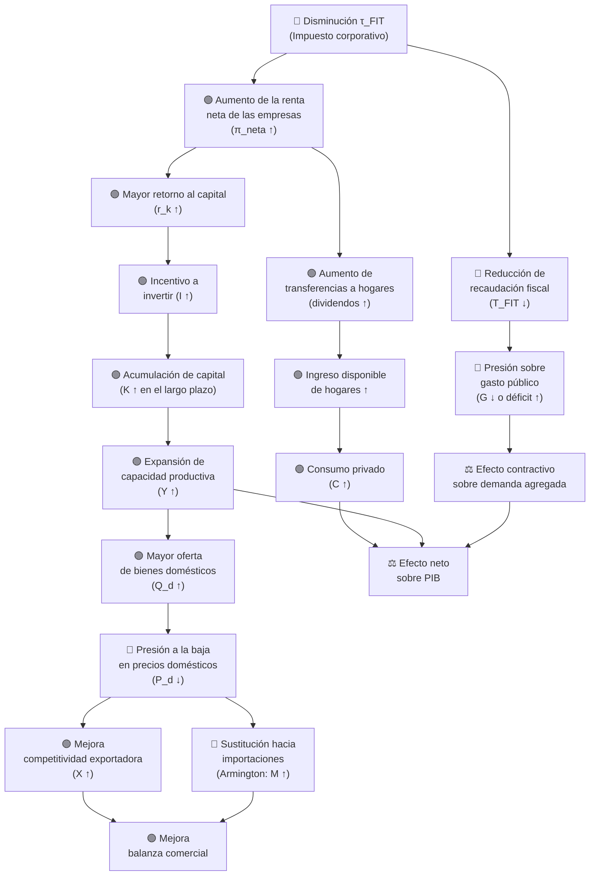
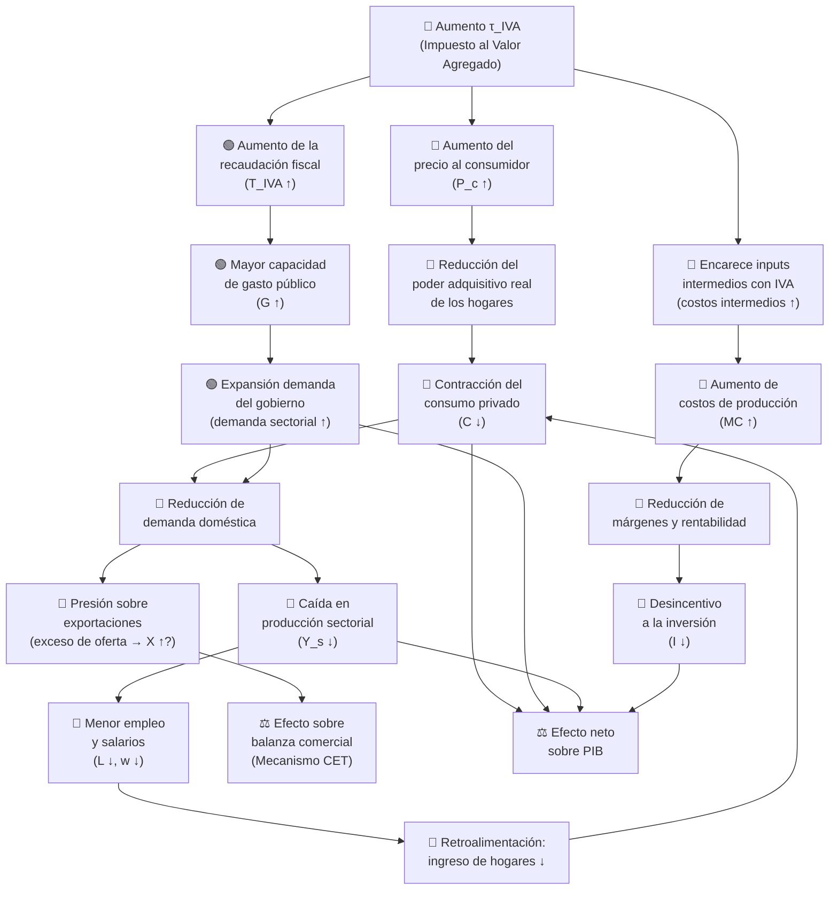
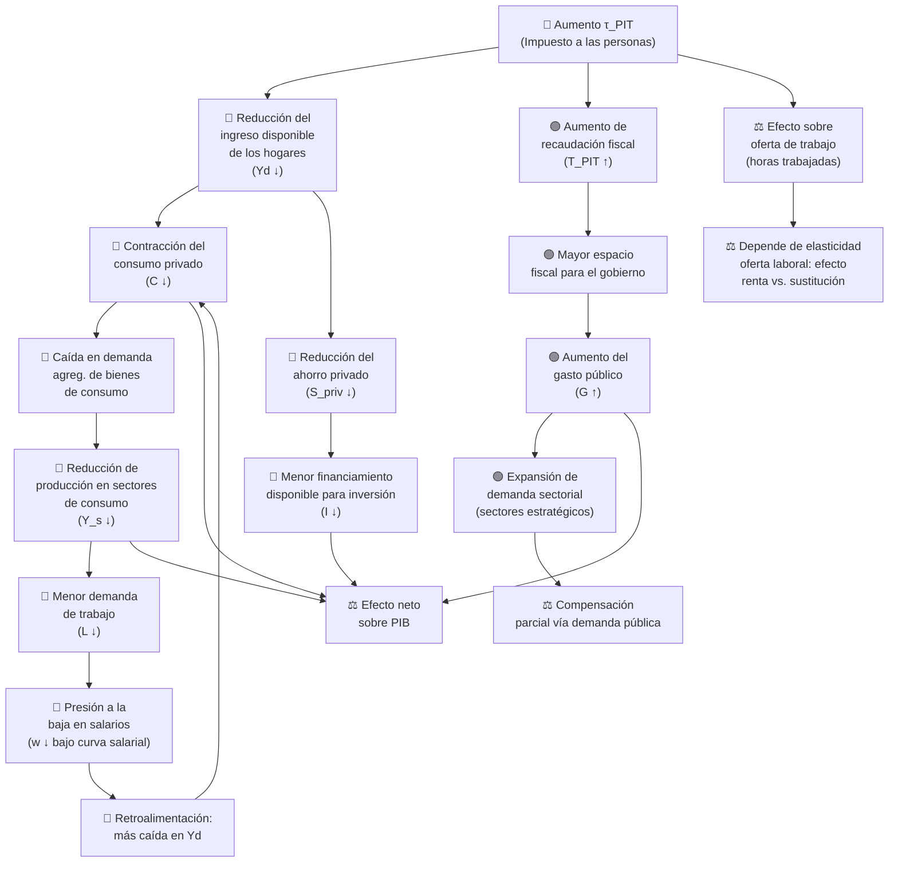
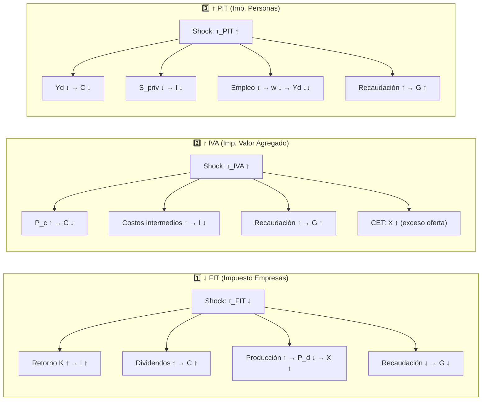

# Esquemas de Transmisión de Efectos — Políticas Fiscales Simuladas
### Modelo de Equilibrio General Computable — Chile (6 Sectores)

---

> **Convenciones:**
> - 🔴 Efecto negativo / reducción
> - 🟢 Efecto positivo / expansión
> - ⚖️ Efecto ambiguo / depende de parámetros
> - Las flechas sólidas (→) indican el canal de transmisión principal.
> - Las flechas punteadas (⇢) indican efectos secundarios o de equilibrio general.

---

## 1. Disminución del Impuesto a las Empresas (FIT — *Firm Income Tax*)

**Shock:** Reducción de la tasa del impuesto corporativo $\tau^{FIT}$

### Esquema de Transmisión

### Resumen de Canales

| Canal | Mecanismo | Signo |
|---|---|---|
| **Inversión** | Mayor retorno neto al capital estimula la inversión privada | 🟢 |
| **Consumo** | Mayores dividendos elevan el ingreso disponible de los hogares | 🟢 |
| **Oferta sectorial** | Expansión productiva reduce costos y precios domésticos | 🟢 |
| **Exportaciones** | Precios domésticos menores mejoran competitividad externa (CET) | 🟢 |
| **Recaudación** | Caída directa de ingresos fiscales por menores tasas | 🔴 |
| **Gasto público** | Restricción fiscal contrae la demanda del gobierno | 🔴 |
| **Efecto neto PIB** | Depende de la magnitud del estímulo privado vs. contracción fiscal | ⚖️ |

---

## 2. Aumento del Impuesto al Valor Agregado (IVA — *VAT*)

**Shock:** Aumento de la tasa del IVA $\tau^{IVA}$

### Esquema de Transmisión

### Resumen de Canales

| Canal | Mecanismo | Signo |
|---|---|---|
| **Precio al consumidor** | El IVA se traslada al precio final, contrayendo el consumo real | 🔴 |
| **Recaudación** | Incremento directo en ingresos tributarios del gobierno | 🟢 |
| **Gasto público** | Mayor recaudación habilita expansión del gasto de gobierno | 🟢 |
| **Demanda doméstica** | La caída en consumo privado supera (parcialmente) el alza en G | 🔴 |
| **Costos intermedios** | Sectores que no recuperan IVA enfrentan mayores costos | 🔴 |
| **Inversión** | Menor rentabilidad y demanda reducen el incentivo a invertir | 🔴 |
| **Exportaciones** | Exceso de oferta interna redirige producción al exterior (CET) | ⚖️ |
| **Efecto neto PIB** | Generalmente contractivo; compensado parcialmente por G | ⚖️ |

---

## 3. Aumento del Impuesto a las Personas (PIT — *Personal Income Tax*)

**Shock:** Aumento de la tasa del impuesto al ingreso personal $\tau^{PIT}$

### Esquema de Transmisión

### Resumen de Canales

| Canal | Mecanismo | Signo |
|---|---|---|
| **Ingreso disponible** | La carga tributaria reduce directamente el ingreso post-impuesto | 🔴 |
| **Consumo privado** | Menor ingreso disponible contrae el consumo de los hogares | 🔴 |
| **Ahorro privado** | Hogares ajustan ahorro a la baja para sostener el consumo | 🔴 |
| **Inversión** | Menor ahorro privado restringe el financiamiento de la inversión | 🔴 |
| **Mercado laboral** | Menor demanda sectorial presiona empleo y salarios a la baja | 🔴 |
| **Recaudación** | Incremento directo en ingresos tributarios del gobierno | 🟢 |
| **Gasto público** | Mayor recaudación habilita expansión del gasto de gobierno | 🟢 |
| **Oferta laboral** | El efecto sobre horas trabajadas depende de la elasticidad laboral | ⚖️ |
| **Efecto neto PIB** | Generalmente contractivo; compensado por mayor G | ⚖️ |

---

## Comparación de los Tres Esquemas

### Tabla Comparativa de Efectos Macroeconómicos

| Variable | ↓ FIT | ↑ IVA | ↑ PIT |
|---|:---:|:---:|:---:|
| **Consumo privado (C)** | 🟢 | 🔴 | 🔴 |
| **Inversión privada (I)** | 🟢 | 🔴 | 🔴 |
| **Gasto público (G)** | 🔴 | 🟢 | 🟢 |
| **Exportaciones (X)** | 🟢 | ⚖️ | ⚖️ |
| **Importaciones (M)** | ⚖️ | 🔴 | 🔴 |
| **Empleo (L)** | 🟢 | 🔴 | 🔴 |
| **Salario real (w/P)** | 🟢 | 🔴 | 🔴 |
| **Precio doméstico (P_d)** | 🔴 | 🟢 | ⚖️ |
| **Recaudación total (T)** | 🔴 | 🟢 | 🟢 |
| **PIB (Y)** | ⚖️ | ⚖️ | ⚖️ |

> **Nota:** Los efectos sobre el PIB son ambiguos en los tres casos, ya que el resultado neto depende de la magnitud relativa de los efectos expansivos y contractivos, así como de los parámetros de elasticidad del modelo (Armington, CET, curva salarial, elasticidad del consumo, etc.).

---

## Notas Metodológicas del Modelo

- **Mercado laboral:** Se asume una curva salarial (*wage curve*) donde el salario real responde positivamente al nivel de empleo: $\ln(w/P) = \beta_0 + \beta_L \ln(L)$. Esto genera desempleo endógeno y amplifica los efectos contractivos sobre el ingreso de los hogares.
- **Comercio exterior:** Las exportaciones y la producción doméstica se asignan vía función CET (*Constant Elasticity of Transformation*); las importaciones compiten con bienes domésticos vía función Armington.
- **Cierre macroeconómico:** Se asume tipo de cambio flexible con ahorro externo fijo, lo que endogeniza el tipo de cambio y permite ajustes en la balanza comercial.
- **Inversión:** El cierre sectorial fija la inversión pública y amortigua la inversión privada vía una elasticidad de potencia, lo que modera los efectos de acelerador.
- **Estructura productiva:** La función de producción sigue una estructura Leontief-anidada con insumos intermedios de proporciones fijas y factores primarios (capital y trabajo) con elasticidad de sustitución.

---

*Documento generado: Abril 2026 | Modelo CGE Chile 6 Sectores — gEcon/R*
